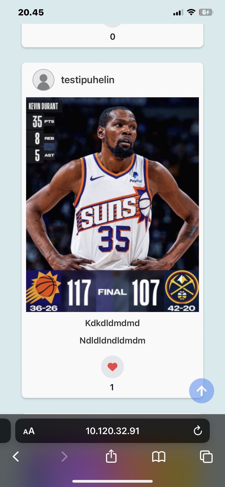
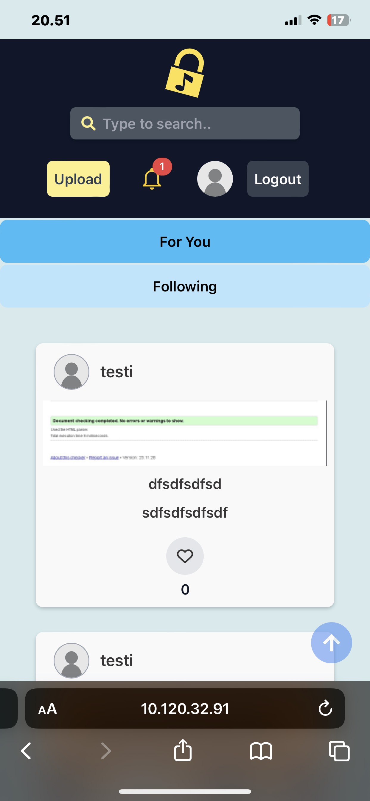
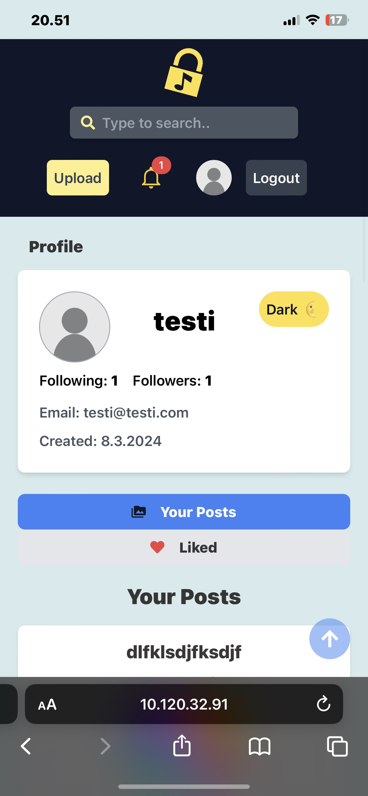
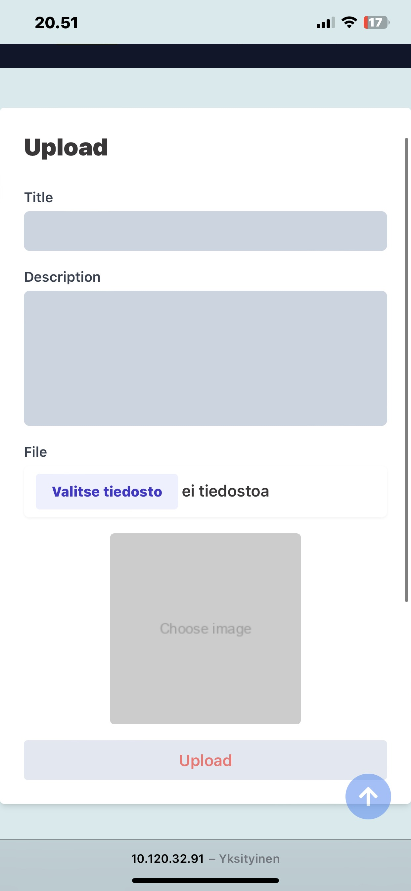
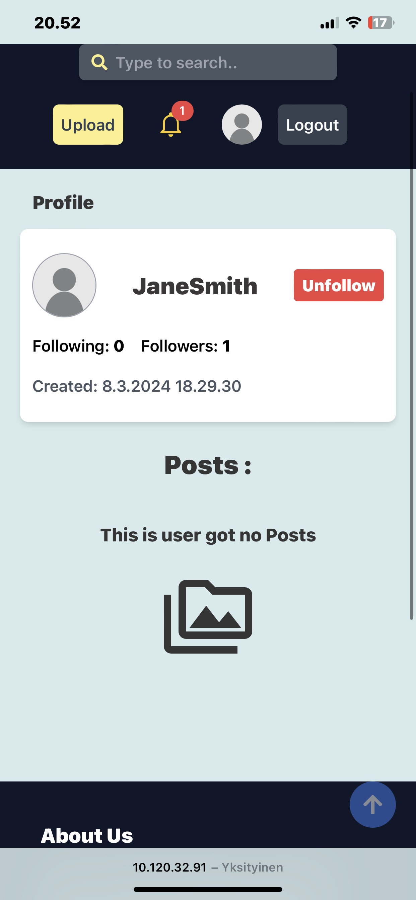
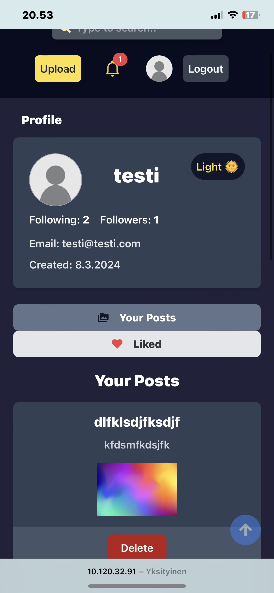

# MediaSharingApp


## APP

[MediaSharingApp](http://10.120.32.91/)


## ApiDoc

* [media-api](http://10.120.32.91/media-api/)
* [auth-api](http://10.120.32.91/auth-api/)

## BE Linkit

* [Auth](http://10.120.32.91/auth-api/api/v1)
* [Upload](http://10.120.32.91/upload-api/api/v1)
* [Media-api](http://10.120.32.91/media-api/api/v1)


## Toimminnalisuudet

* Kirjautuminen, rekisteröinti sekä ulos kirjautuminen.

* Median lisääminen.

* Mediaa pystyy tykkäämään sekä kommentoimaan.

* Toisia käyttäjiä pystyy seurata ja ei seurata.

* Käyttäjät saavat ilmoituksia, kun toinen käyttäjä kommentoi / tykkää sinun julkaisua tai seuraa sinua.

* Ilmoitusten tilaa pystyy muuttamaan klikkaamalla ilmoitusta.

* Etusivulla voi katsella seurattujen käyttäjien julkaisemia kuvia sekä kaikkia julkaisuja.

* Sivun teemaa pystyy vaihtamaan.

* Omia julkaisuja voi poistaa profiilin kautta.

* Profiilista pystyy katsella tykkättyjä medioita.

* Käyttäjiä ja MediaItemeita voi hakea hakupalkin avulla.

## DB

```sql
DROP DATABASE IF EXISTS MediaSharingApp;
CREATE DATABASE MediaSharingApp;
USE MediaSharingApp;

-- Tables

CREATE TABLE UserLevels (
    level_id INT AUTO_INCREMENT PRIMARY KEY,
    level_name VARCHAR(50) NOT NULL
);

CREATE TABLE Users (
    user_id INT AUTO_INCREMENT PRIMARY KEY,
    username VARCHAR(50) NOT NULL UNIQUE,
    password VARCHAR(255) NOT NULL,
    email VARCHAR(100) NOT NULL UNIQUE,
    user_level_id INT,
    created_at TIMESTAMP DEFAULT CURRENT_TIMESTAMP,
    FOREIGN KEY (user_level_id) REFERENCES UserLevels(level_id)
);

CREATE TABLE MediaItems (
    media_id INT NOT NULL AUTO_INCREMENT PRIMARY KEY,
    user_id INT NOT NULL,
    filename VARCHAR(255) NOT NULL,
    filesize INT NOT NULL,
    media_type VARCHAR(255) NOT NULL,
    title VARCHAR(255) NOT NULL,
    description VARCHAR(255),
    created_at TIMESTAMP DEFAULT CURRENT_TIMESTAMP,
    FOREIGN KEY (user_id) REFERENCES Users(user_id)
);

CREATE TABLE Comments (
    comment_id INT AUTO_INCREMENT PRIMARY KEY,
    media_id INT NOT NULL,
    user_id INT NOT NULL,
    comment_text TEXT NOT NULL,
    created_at TIMESTAMP DEFAULT CURRENT_TIMESTAMP,
    FOREIGN KEY (media_id) REFERENCES MediaItems(media_id) ON DELETE CASCADE,
    FOREIGN KEY (user_id) REFERENCES Users(user_id)
);

CREATE TABLE Likes (
    like_id INT AUTO_INCREMENT PRIMARY KEY,
    media_id INT NOT NULL,
    user_id INT NOT NULL,
    created_at TIMESTAMP DEFAULT CURRENT_TIMESTAMP,
    FOREIGN KEY (media_id) REFERENCES MediaItems(media_id) ON DELETE CASCADE,
    FOREIGN KEY (user_id) REFERENCES Users(user_id)
);

CREATE TABLE UserFollows (
    follow_id INT AUTO_INCREMENT PRIMARY KEY,
    follower_id INT NOT NULL,
    following_id INT NOT NULL,
    followed_at TIMESTAMP DEFAULT CURRENT_TIMESTAMP,
    FOREIGN KEY (follower_id) REFERENCES Users(user_id),
    FOREIGN KEY (following_id) REFERENCES Users(user_id),
    UNIQUE (follower_id, following_id)
);

CREATE TABLE Notifications (
    notification_id INT AUTO_INCREMENT PRIMARY KEY,
    user_id INT NOT NULL,
    notification_type ENUM('COMMENT', 'FOLLOW', 'LIKE') NOT NULL,
    notification_content TEXT,
    reference_id INT,
    created_at TIMESTAMP DEFAULT CURRENT_TIMESTAMP,
    read_status BOOLEAN DEFAULT FALSE,
    FOREIGN KEY (user_id) REFERENCES Users(user_id)
);
```

## Bugit

-


## Screenshots









